# **Arify**

Đánh giá chất lượng môi trường

# Mục Lục

[**A. THÔNG TIN CHUNG** 2](#_Toc83783780)

* [1. Giới thiệu sản phẩm 2](#giới-thiệu-sản-phẩm)

* [2. Giới thiệu tác giả 2](#giới-thiệu-tác-giả)

[B. MÔ TẢ SẢN PHẨM 2](#b.-mô-tả-sản-phẩm)

* [1. Yêu cầu khi sử dụng 2](#yêu-cầu-khi-sử-dụng)

* [2. Thời gian hoàn thành sản phẩm 2](#thời-gian-hoàn-thành-sản-phẩm)

[C. HƯỚNG DẪN SỬ DỤNG 2](#c.-hướng-dẫn-sử-dụng)

[D. NỘI DUNG THUYẾT MINH 4](#d.-nội-dung-thuyết-minh)

* [1. Ý tưởng thiết kế 5](#ý-tưởng-thiết-kế)

* [2. Giới thiệu sơ lược (TL;DR) 5](#giới-thiệu-sơ-lược-tldr)

* [3. Các chức năng chính 7](#các-chức-năng-chính)

    * [a. Chức năng đo lường (Airify) 7](#a.-chức-năng-đo-lường-airify)

    * [b. Chức năng cảnh báo (Airify - Airter)
    7](#b.-chức-năng-cảnh-báo-airify---airter)

    * [c. Chức năng lưu trữ dữ liệu trực tuyến(Airify)
    8](#c.-chức-năng-lưu-trữ-dữ-liệu-trực-tuyếnairify)

    * [d. Chức năng cập nhật dữ liệu (Airter)
    8](#d.-chức-năng-cập-nhật-dữ-liệu-airter)

    * [e. Chức năng đồng bộ dữ liệu (Airify - Airter)
    9](#e.-chức-năng-đồng-bộ-dữ-liệu-airify---airter)

* [4. Công nghệ 10](#công-nghệ)

    * [a. Developer Friendly CodeCode 10](#a.-developer-friendly-codecode)

    * [b. Giao diện hiện đại, tối ưu và đẹp mắt
    10](#b.-giao-diện-hiện-đại-tối-ưu-và-đẹp-mắt)

    * [c. Phần cứng và các cảm biến 11](#c.-phần-cứng-và-các-cảm-biến)

* [5. Xây dựng sản phẩm 12](#xây-dựng-sản-phẩm)

    * [a. Xây dựng bề ngoài (cover) 12](#a.-xây-dựng-bề-ngoài-cover)

    * [b. Xây dựng Firmware cho Airify 12](#b.-xây-dựng-firmware-cho-airify)

    * [c. Xuất dữ liệu 15](#c.-xuất-dữ-liệu)

    * [d. Theo dõi dữ liệu, gửi thông báo
    18](#d.-theo-dõi-dữ-liệu-gửi-thông-báo)

    * [e. Đăng kí ứng dụng Airter qua Firebase
    21](#e.-đăng-kí-ứng-dụng-airter-qua-firebase)

    * [f . Xây dựng ứng giao diện ứng dụng
    23](#f-.-xây-dựng-ứng-giao-diện-ứng-dụng)

    * [g . Tạo hiệu ứng phức tạp 23](#g-.-tạo-hiệu-ứng-phức-tạp)

    * [h . Xác định vị trí 24](#h-.-xác-định-vị-trí)

    * [i . Nhận dữ liệu từ Internet 25](#i-.-nhận-dữ-liệu-từ-internet)

    * [j . Xử lí dữ liệu ở ứng dụng 27](#j-.-xử-lí-dữ-liệu-ở-ứng-dụng)

[E. KẾT LUẬN, ĐÁNH GIÁ 30](#e.-kết-luận-đánh-giá)

* [1. Kết quả thử nghiệm của sản phẩm trong thực tế
30](#kết-quả-thử-nghiệm-của-sản-phẩm-trong-thực-tế)

    * [a . Điểm mới, ưu điểm 30](#a-.-điểm-mới-ưu-điểm)

    * [b. Bảng số liệu thu được 30](#b.-bảng-số-liệu-thu-được)

* [2. Hiệu quả đem lại khi sử dụng sản phẩm
30](#hiệu-quả-đem-lại-khi-sử-dụng-sản-phẩm)

* [3. Tiềm năng ứng dụng 31](#tiềm-năng-ứng-dụng)

[F. CHÚ THÍCH, TÀI LIỆU THAM KHẢO 32](#f.-chú-thích-tài-liệu-tham-khảo)

# **A. THÔNG TIN CHUNG**

## 1. Giới thiệu sản phẩm

Tên sản phẩm: Airify -- thiết bị đánh giá chất lượng không khí

Ngôn ngữ lập trình: Dart, Python, C++, Javascript, Java, Swift

Cấu hình cài đặt: Hỗ trợ chính thức: Android (5.0+), IOS (10.0+),

> Hỗ trợ thử nghiệm (Beta): Các trình duyệt và phiên bản trình duyệt ra
> mắt sau IE 9, Linux, Windows, Mac.

## 2. Giới thiệu tác giả

Tên tác giả: Trần Vũ Mạnh Đức

Học sinh lớp: 11/12 Trường: THPT Phan Châu Trinh

Điện thoại: +8486 546 65 41 Email: <ronanhansel@gmail.com>

Địa chỉ Facebook: fb.com/TVMDrh Github: <https://github.com/ronanhansel>

# B. MÔ TẢ SẢN PHẨM

## 1. Yêu cầu khi sử dụng

Kết nối wifi

## 2. Thời gian hoàn thành sản phẩm

2 Tháng (17/4 -- 24/6)

# C. HƯỚNG DẪN SỬ DỤNG

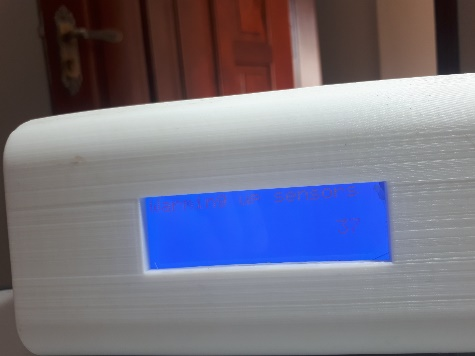Đầu tiên, bạn cần phải bật máy Airify,
trong lúc máy đang khởi động và làm nóng các cảm biến thì Module WiFi sẽ
khởi động ngay lập tức (với thời gian khởi động từ 2-3s)

Không cần phải đợi cảm biến làm nóng, bạn
có thể thấy được điểm truy cập di động mang tên "Airify", bạn cần kết
nối với nó (điểm truy cập này không có mật khẩu).

Tiếp theo, truy cập vào trang 192.168.4.1 bằng trình duyệt web để thiết
đặt, vào "Configure WiFi" và nhập tên mạng, mật khẩu (máy sẽ hiện các
mạng hiện có để bạn có thể đối chiếu)

Cài ứng dụng trên điện thoại bằng file cài đặt và truy cập vào ứng dụng

# D. NỘI DUNG THUYẾT MINH

Hiện nay, vấn đề ô nhiễm không khí đã và đang ngày càng trở nên nghiêm
trọng và khó khắc phục hơn ở Việt Nam cũng như trên toàn thế giới. Vấn
đề ô nhiễm môi trường không chỉ trực tiếp làm tổn hại đến sức khỏe, tính
mạng con người mà còn ảnh hưởng đến những thế hệ mai sau. Nhiều người
thường nghĩ rằng tình trạng ô nhiễm không khí chỉ xảy ra ở đường phố hay
các khu công nghiệp mà không biết rằng không gian trong chính ngôi nhà
mình đang sống cũng có thể bị ô nhiễm nghiêm trọng. Tình trạng ô nhiễm
không khí trong nhà có thể ảnh hưởng đến sức khỏe của tất cả mọi người ở
mọi độ tuổi. Trong một số trường hợp, tình trạng này có thể gây ra các
vấn đề sức khỏe nghiêm trọng và rối loạn phát triển, đặc biệt là ở trẻ
sơ sinh. Tác động kích thích, như khô họng và ho, cảm nhận ngay sau một
thời gian ngắn tiếp xúc với ô nhiễm không khí trong nhà (vài ngày hay
tuần). Tác động lâu dài hơn, như gây ung thư, có thể xuất hiện sau vài
năm.

Ô nhiễm trong nhà do đun nấu có thể cao gấp 10 lần mức ô nhiễm tại các
thành phố ô nhiễm nhất thế giới. Người nghèo phải sinh sống trong không
gian chật hẹp và phải sử dụng những loại nhiên liệu thô sơ, rẻ tiền là
nạn nhân đầu tiên của nạn ô nhiễm trong nhà. Họ không có điều kiện tiếp
cận với các loại nhiên liệu sạch hay hệ thống dẫn, lọc khí thải. Nhưng
ngay khi sống tại thôn quê với khoảng không gian lớn để nấu nướng, người
nghèo cũng thường nấu bếp ngay trong nhà để tiện sinh hoạt. Các bà mẹ và
trẻ em bị ảnh hưởng nhiều nhất vì họ thường sinh hoạt trong nhà, thậm
chí nhiều bà mẹ bế con khi đun nấu. Có lẽ họ không biết rằng như vậy sẽ
ảnh hưởng rất nghiêm trọng đến hệ hô hấp của trẻ nhỏ, tác động xấu tới
phổi của các bé nhất là khi sức khỏe các em còn yếu, từ đó để lại hệ lụy
lâu dài.

Mức độ ô nhiễm ngoài trời được đo và ghi lại ở hầu hết mỗi nước ở châu
Âu, và có một số mức độ mà các nước phải giữ. Một số nước đã thiết lập
các hướng dẫn cho các mức độ ô nhiễm không khí trong nhà, nhưng thiết
lập mức độ tối đa cho phép về ô nhiễm không khí trong nhà là rất khó
khăn. Có một số lượng nhất định sự lựa chọn cá nhân trong việc kiểm soát
những gì chúng ta sử dụng trong nhà và cách thức thông gió cho nhà ở.
Rất khó kiểm tra, thiết lập và duy trì mức độ đúng trong các môi trường
bên trong các trường học, văn phòng và cửa hàng. Tuy nhiên, chúng ta có
thể nhận thức được những rủi ro do ô nhiễm trong nhà để từ đó ta có thể
cố gắng để giảm thiểu chúng. Một thiết bị đánh giá chất lượng không khí
là giải pháp tốt nhất giúp chúng ta nắm bắt được chất lượng không khí
tại khu vực mình sinh sống.

Hiện nay đã có khá nhiều thiết bị có thể đo chất lượng không khí, tuy
nhiên sau khi tìm hiểu, em nhận thấy ở các thiết bị này có một số điểm
chưa đạt như mong muốn của người dân Việt Nam:

-   Giá thành cao

-   Độ linh động không cao

-   Không hỗ trợ cảnh báo từ xa

Với mong muốn tạo ra một thiết bị có thể đo mức ô nhiễm không khí thật
chính xác, nhỏ gọn, có mức giá thấp, để mỗi gia đình, mỗi cá nhân đều có
thể sở hữu một cái cho riêng mình và đáp ứng vấn đề được nêu trên, em đã
nghiên cứu và thực hiện sản phẩm AIRIFY -- ĐÁNH GIÁ CHẤT LƯỢNG MÔI
TRƯỜNG

Ngoài ra, trong tình hình dịch bệnh đang diễn biến phức tạp, em cũng
luôn trăn trở phải làm sao để mỗi người dân được cung cấp thông tin mới
nhất và chính xác nhất về tình hình dịch bệnh đặc biệt ở khu vực xung
quanh và phạm vi cả nước. Vì vậy, em đã bổ sung vào sản phẩm số liệu và
biểu đồ thống kê tình hình dịch bệnh được cập nhật liên tục ở các tỉnh
thành trên toàn quốc.

## Ý tưởng thiết kế

Dựa trên câu hỏi và vấn đề nghiên cứu, em đưa ra ý tưởng sản phẩm, hệ
thiết bị hoàn chỉnh sẽ gồm:

> \- Bộ cảm biến MQx (MQ-5, MQ-7, MQ-135, DHT11) với các cài đặt tùy
> chỉnh để phát hiện nồng độ của các loại khí (khí CO, CO2, NH4,\...).
> Sau đó sử dụng dữ liệu thu thập được để đánh giá chất lượng không khí
> (So sánh nồng độ của các khí độc với chỉ số cho trước).
>
> \- Khối xử lí trung tâm Arduino Uno R3: để hỗ trợ vi điều khiển, kết
> nối với máy tính bằng cáp USB hoặc cấp nguồn bằng bộ chuyển đổi
> AC-to-DC hoặc pin để sử dụng ...
>
> \- Bộ giao tiếp (MODULE ESP8266): Thiết bị module wifi esp8266 sẽ giúp
> cho Arduino có khả năng truy cập mạng wifi để truyền và nhận dữ liệu
> từ phía cảm biến và máy chủ trên mây.
>
> \- Sử dụng các phần mềm hỗ trợ: Android Studio để xây dựng mã nguồn,
> Flutter Framework để xây dựng UI phần mềm, Google Firebase làm máy
> chủ, Rive để tạo hiệu ứng cho ứng dụng.

## Giới thiệu sơ lược (TL;DR)

Airify là một sản phẩm bao gồm phần mềm và phần cứng, cả hai đều có khả
năng hoạt động độc lập. Thiết bị có khả năng đo lường thông số về các
thành phần trong không khí (CO2, CO, khí gas tự nhiên,\...) , và nhiệt
độ, độ ẩm. Về phần mềm có tên là Airter có khả năng thực hiện được rất
nhiều tiện ích bao gồm (nhưng không giới hạn ở):

-   Đồng bộ dữ liệu từ phần cứng Airify

-   Gửi thông báo cảnh báo đến người dùng khi phát hiện thành phần không
    khí đạt đến ngưỡng độc hại

-   Đưa ra lời khuyên, mẹo, thông tin về các thành phần khí

-   Đồng bộ dữ liệu từ các trạm đo ở khu vực lân cận.

> Tính năng đặc biệt:

Trong bối cảnh dịch bệnh hiện nay, việc cập nhật thông tin mới nhất,
chính xác nhất một cách tiện nghi nhất là điều cần thiết. Dựa trên những
nhu cầu đó, phần mềm Airter còn giới thiệu thêm các tính năng theo dõi
tình hình dịch bệnh COVID-19 bao gồm:

-   Cập nhật liên tục dữ liệu từ Bộ Y Tế, WHO, và Wikipedia (và các
    nguồn khác sẽ được nói rõ hơn ở dưới)

-   Biểu diễn trực quan các số liệu và vẽ biểu đồ thống kê.

Sơ đồ hoạt động:

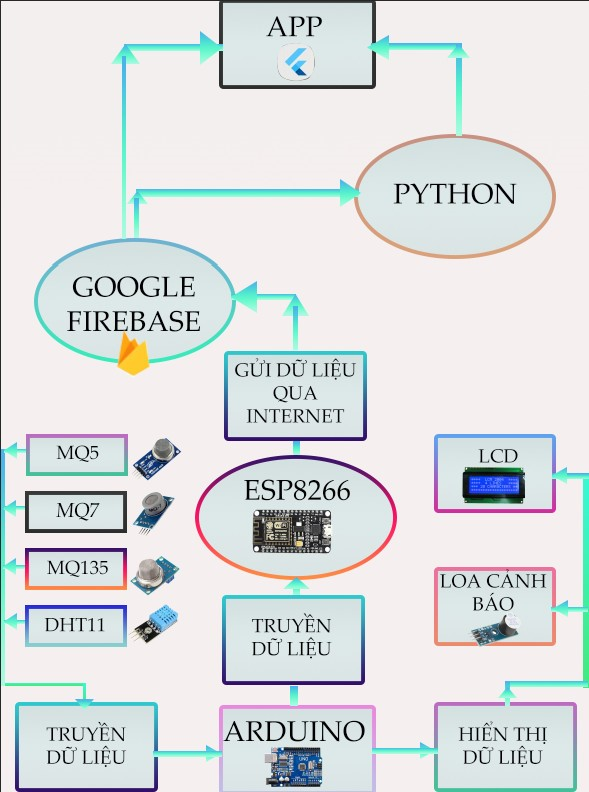

## Các chức năng chính

### a. Chức năng đo lường (Airify)

Với màn hình LCD, Airify thực sự không cần hướng dẫn sử dụng để bắt đầu.
Mọi thông số được hiển thị trực tiếp trong thời gian thực lên màn hình
một cách cụ thể và dễ nhìn nhất.

### b. Chức năng cảnh báo (Airify - Airter)

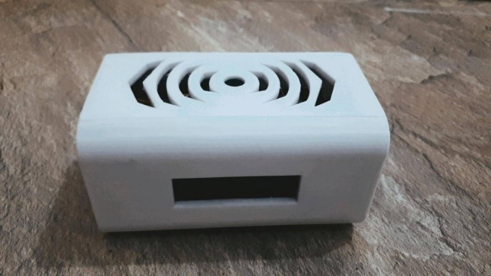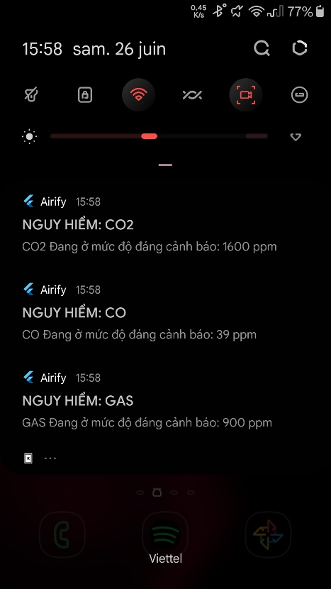

Sử dụng loa built-in (bên trái) vào Airify hoặc sử dụng thông báo từ ứng
dụng Airter (bên phải). Trong khi loa cảnh báo sẽ chỉ phát ra âm thanh
khi các loại khí đạt đến ngưỡng gây hại thì Airter sẽ hiển thị đầy đủ
các thông số cụ thể (Tên loại khí, nồng độ), Airter sẽ dùng thông báo hệ
thống và với mức độ ưu tiên cao nhất để luôn đứng ở đầu và luôn hiển thị
cảnh báo người dùng.

### c. Chức năng lưu trữ dữ liệu trực tuyến(Airify)

Ngoài khả năng đo lường và cảnh báo, Airify còn có thể lưu trữ các thông
số lên máy chủ trên mây một cách lâu dài qua wifi.

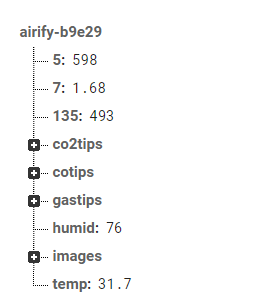

### d. Chức năng cập nhật dữ liệu (Airter)

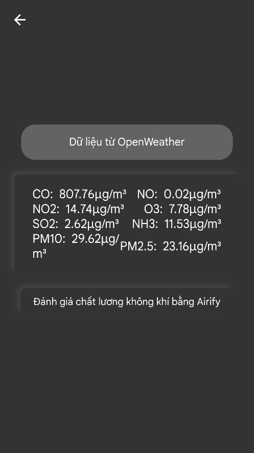
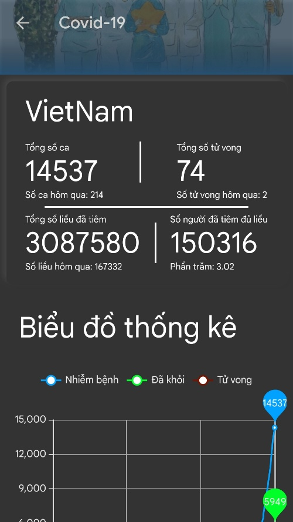

Airter có khả năng giao tiếp với các nguồn thông tin vô tận qua
Internet. Bằng cách tận dụng những lợi ích đó, ta có thể dễ dàng khiến
cho ứng dụng trở nên hữu ích hơn. Airter sẽ lấy dữ liệu của các cơ sở dữ
liệu trên mây về độ ô nhiểm của không khí khu vực và cả tình hình dịch
bệnh qua các nguồn đáng tin cậy, tốc độ cao và bảo mật.

### e. Chức năng đồng bộ dữ liệu (Airify - Airter)

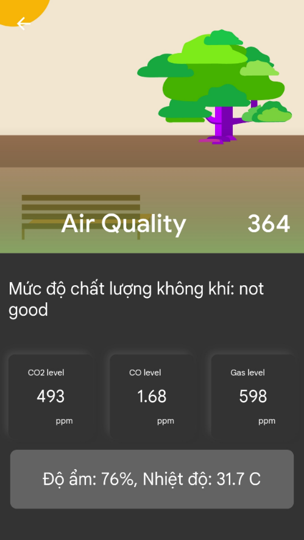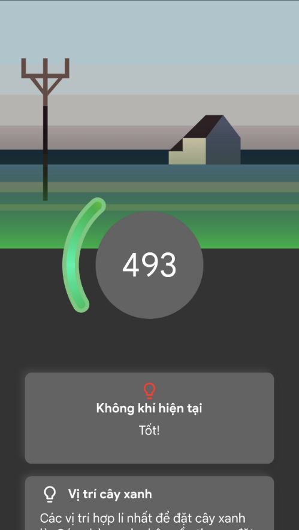

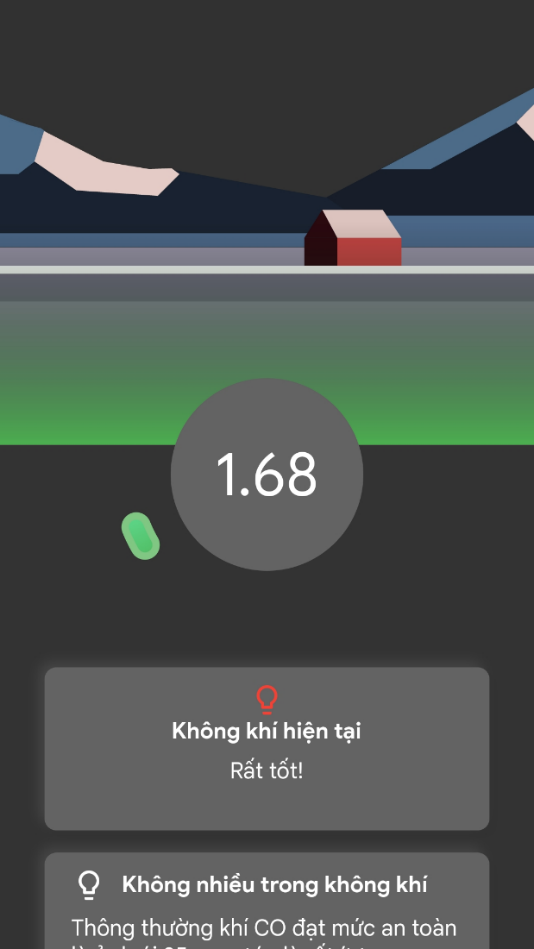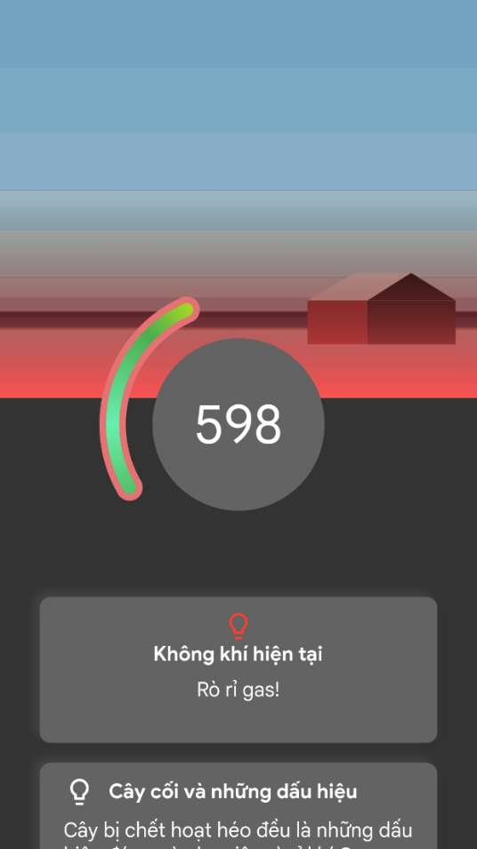

Cuối cùng, với chức năng quan trọng nhất chính là đồng bộ dữ liệu giữa
Airify và Airter giúp cho người dùng có thể kiểm tra, xem xét và được
thông báo (*mục b. Chức năng cảnh bảo*) từ xa và hoàn toàn không giới
hạn phạm vi. Có nghĩa người dùng có thể hoàn toàn ở bên kia bán cầu mà
vẫn biết được nồng độ khí CO2 ở trong nhà của mình, chỉ cần kết nối
Internet không cần phải mạnh bởi ứng dụng sử dụng rất ít tài nguyên.

## Công nghệ

Airter được viết dưới dạng Single Code Base có nghĩa chúng có thể được
chuyển sang các hệ điều hành khác như IOS, Fuchsia, cả hệ điều hành của
PC như MacOS, Windows, Linux và cuối inux và cuối cùng Airter còn có thể
host trực tuyến qua các website.

Với sản phẩm Airify, thiết bị được thiết đặt bằng ngôn ngữ lập trình
C++, một ngôn ngữ rất phổ biến, trực quan và dễ sử dụng.

Về máy chủ và các phương thức giao tiếp qua mạng, thiết bị sử dụng
Python để giám sát thay đổi về các thông số từ đó có thể gửi thông báo
về thiết bị thông qua Firebase Cloud Messaging (FCM)

### a. Developer Friendly CodeCode

Phần mềm được viết trên ngôn ngữ Dart, là một sự kết hợp hoàn hảo giữa
C# và Java, giúp cho mã nguồn của ứng dụng Airter dễ nhìn, dễ sửa lỗi
ngay từ ban đầu. Bên cạnh đó, trong quá trình xây dựng ứng dụng, các
chức năng phức tạp đều đã được comment và chú thích cẩn thận để mọi
người có thể chỉnh sửa, cải thiện từ mã nguồn trên Github.

### b. Giao diện hiện đại, tối ưu và đẹp mắt

Một trong những điểm nhấn của ứng dụng là UI/UX (User Interface/User
Experience) thứ mà đã chiếm khá nhiều thời gian để nghiên cứu. Cách bố
trí và giao diện đều được sắp xếp một cách tỉ mỉ và chi tiết nhất, đảm
bảo cho người dùng dễ dàng sử dụng. Ngoài ra các hiệu ứng đều được tối
ưu hóa để ứng dụng có thể trở nên mượt mà nhất (với các tối ưu của ứng
dụng và của Flutter, Airter có thể giữ tỉ lệ khung hình lên đến 60FPS
trong hơn 90% thời gian chu kì hoạt động của ứng dụng), dưới đây là ví
dụ điển hình cho một trong số nhiều các hiệu ứng được thêm vào:

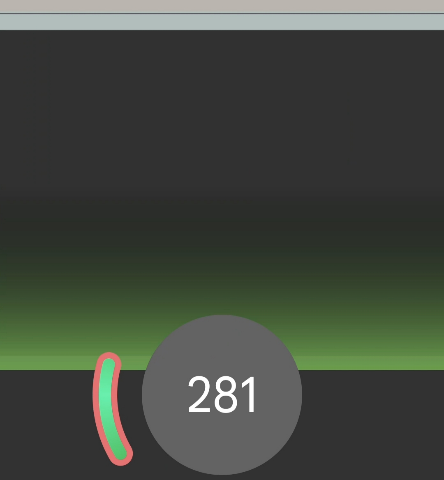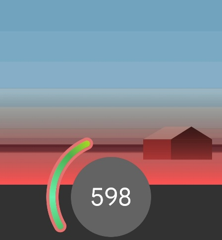

*Màu gradient của ForeGround từ từ chuyển dần từ màu xanh sang đỏ khi
nồng độ đạt đến mức báo động, trong lúc đó thanh chỉ thị cũng dần đi từ
0 đến vị trí tương ứng, ngoài ra BackGround cũng đồng thời hoàn thành
hiệu ứng hoạt cảnh.*

Và đây cũng là một trong những yêu cầu tối thiểu khi bắt đầu thực hiện
dự án:

-   Phải có độ tương thích cao

-   Hiệu năng vượt trội

-   Có các hiệu ứng mượt mà

Hầu hết các yêu cầu trên đều khá phổ biến đối với một ứng dụng nhưng
điều gì lại khiến cho Airter vượt trội hơn những ứng dụng đi trước? Đó
chính là sự hỗ trợ đầy đủ của Framework Flutter, một nền tảng khá mới ra
mắt vào mùa hè năm 2017 bởi Google.

### c. Phần cứng và các cảm biến

-   Khối xử lí trung tâm Arduino Uno R3

-   Bộ giao tiếp (MODULE ESP8266)

-   Màn hình LCD 2004

-   Cảm biến MQ-5

-   Cảm biến MQ-7

-   Cảm biến MQ-135

-   Cảm biến DHT-11

-   Grove -- Buzzer

## Xây dựng sản phẩm

Đến với công đoạn và quy trình xây dựng sản phẩm, chúng ta sẽ biết được
cách xây dựng sản phẩm và các logic phía sau những mã lệnh.

### a. Xây dựng bề ngoài (cover)

Phần cứng chủ yếu được xây dựng bằng SketchUp, một phần mềm thiết kế đồ
họa đơn giản và dễ sử dụng dành cho tất cả mọi người.

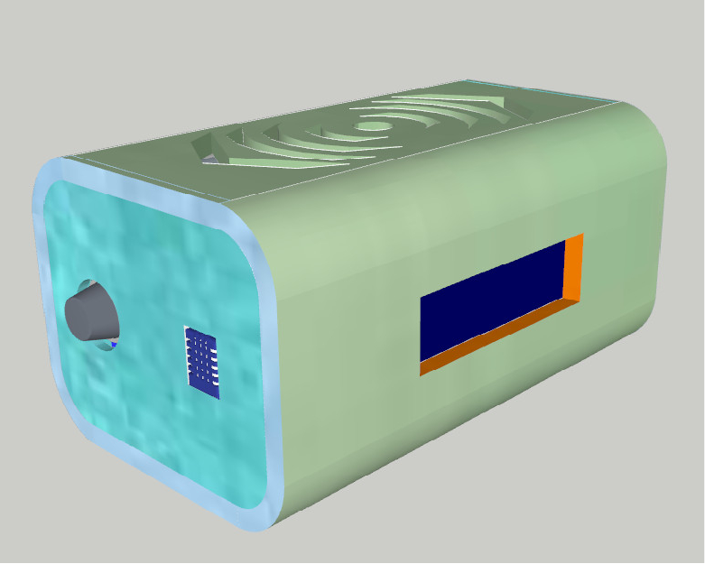

*Finished Product được thiết kế với SketchUp*

### b. Xây dựng Firmware cho Airify

Việc bắt đầu một dự án luôn là điều khó làm nhất, từ một trang giấy
trắng hay một file văn bản trống không, ta phải dần xây dựng một sơ đồ
tư duy (mind map) cho ứng dụng.

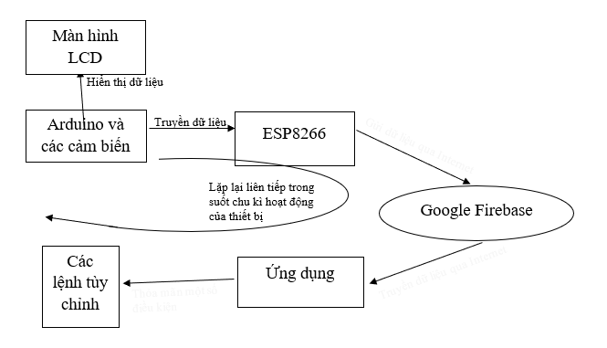

*Arduino sẽ đọc các dữ liệu cảm biến qua AnalogRead và sẽ xuất dữ liệu
đến: màn hình LCD và ESP8266, trong lúc LCD sẽ hiển thị trực tiếp thông
số thì ESP8266 sẽ gửi dữ liệu đến máy chủ Google Firebase. Sau đó Google
Firebase sẽ đưa dữ liệu đến ứng dụng để có thể thực hiện các câu lệnh
tùy chỉnh bên phía Airter*

Bắt đầu với các câu lệnh cơ bản để lấy dữ liệu từ các cảm biến, hầu hết
các cảm biến của Arduino đều không phản ánh giá trị thực mà chỉ đưa ra
các giá trị điện thế (V) tương ứng (trừ cảm biến DHT sẽ cho ra giá trị
thực về nhiệt độ và độ ẩm). Tuy nhiên, các giá trị điện thế này đều có
quy luật và hoàn toàn có thể chuyển sang giá trị thực. Tiếp tục, ta sẽ
lấy MQ-7 làm ví dụ điển hình bởi các cảm biến MQ đều có nguyên lí hoạt
động giống nhau.

Từ datasheet của MQ-7 ta có thể thấy được khả năng đo lường của các loại
khí, mà bây giờ ta sẽ chỉ tập trụng vào đường màu xanh dương tức là khí
CO

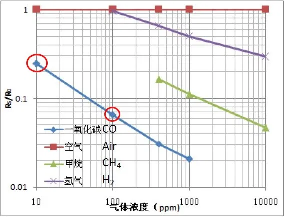

Trong toán học, tất cả những con số biển đổi theo quy luật đều có thể
biểu diễn dưới dạng một *Function (hàm số)*. Trong những công thức biến
đổi để lấy *fuction* ra từ những *variables* (*biến*) có hai công thức
phổ biến nhất đó chính là *Fourier* *Transform* (*FT*) và *Log*-*Log*
*plot* (*LLP*). Tuy nhiên ta có thể thấy trên hình vẽ không phải là
những sóng Sine và những sự lặp lại theo tần số và hai điểm ta cần xét
có thể xem là một đường thẳng của đơn thức vậy nên ta sẽ sử dụng thuật
toán *LLP^(1)^ .* Công thức của *LLP* sẽ được áp dụng dựa trên mối liên
hệ giữa các đơn thức *y=a^k\ ^*. Với mỗi đơn thức lấy log ta sẽ được:

$$logy\  = \ klogx\  + \ loga$$

Đơn giản hóa phương trình bằng cách thay *logx*, *logy* bằng *X* và *Y,*
thay *k* với *m* và thay *loga* với *b,* ta được:

Với m chính là slope (độ dốc) của đồ thị.

$$Y\  = \ mX\  + \ b$$

Công thức tổng quát của một đường thẳng trên LLP sẽ có dạng

$$\text{Lo}g_{(10)}F(x) = mlog_{(10)}x\  + \ b$$

Để tìm slope của một đồ thị ta cần phải có hai điểm trên một đường thẳng
(hai điểm khoanh đỏ ở trên) và lần lượt thay vào biểu thức ở trên.

$$Log\lbrack F(x)\rbrack = mlog(x)\  + \ b$$

Như đã biết, để tìm độ dốc của một đồ thị ta sẽ lấy tích của hiệu
$\text{Δlog}\left\lbrack F(x) \right\rbrack$và $\text{Δlog}(x)$ và ta sẽ
được

$$m = \frac{\log\left( F_{1} \right) - log\left( F_{0} \right)}{\log\left( x_{1} \right) - log\left( x_{0} \right)} = \frac{\log\left( F_{1}\text{/}F_{0} \right)}{\log\left( x_{1}\text{/}x_{0} \right)}$$

Từ đây ta có thể suy ra:
$\log\left( F1\text{/}F0 \right) = mlog\left( x1\text{/}x0 \right) = log\left\lbrack \left( x1\text{/}x0 \right)^{m} \right\rbrack$

Vì $10^{\text{lo}g_{10}(F0)} = F0$ nên
$\frac{F_{1}}{F_{0}} = \left( \frac{x_{1}}{x_{0}} \right)^{m}$

hay: $F_{1} = \frac{F_{0}}{x_{0}^{m}}x_{1}^{m}$

Phương trình chứa dạng: $F(x) = const.x^{m}$

Vậy phương trình LLP đối với đường thẳng chứa hai điểm $(x0,F0),(x1,F1)$
là

$\mathbf{F}\left( \mathbf{x} \right)\mathbf{= F}\left( \mathbf{x}_{\mathbf{0}} \right)\left( \frac{\mathbf{x}}{\mathbf{x}_{\mathbf{0}}} \right)^{\frac{\mathbf{\log}\left( \mathbf{F}_{\mathbf{1}}\textit{\textbf{/}}\mathbf{F}_{\mathbf{0}} \right)}{\mathbf{\log}\left( \mathbf{x}_{\mathbf{1}}\textit{\textbf{/}}\mathbf{x}_{\mathbf{0}} \right)}}$

Xác định hai điểm với giá trị xấp xỉ (0.065, 100), (0.25, 10) thay vào
phương trình ta được:

$$F(x) = 0.0065x^{- 0.585}$$

Vậy mối quan hệ giữa $\text{Rs}\text{/}R0$ và $\text{ppm}$ là
$\frac{\text{Rs}}{R0} = 0.0065x^{- 0.585}$

Cuối cùng rút giá trị $\text{ppm}$ ta được
$ppm = 1538.46.\frac{\text{Rs}}{R0}^{- 1.709}$

Ta có thể sử dụng đoạn code này để tìm giá trị của R0

Với R2 = 2000 bởi hầu hết các bảng mạch đều sử dụng điện trở giá trị
2kOhm.

Chuyển đổi tất cả công thức ở trên thành C++ ta được:

Vậy ta đã có thể xuất các giá trị ppm từ các cảm biến MQx một cách dễ
dàng

### c. Xuất dữ liệu

Sử dụng library của màn hình LCD *LiquidCrystal_I2C,* ta có thể ghi dữ
liệu giống như lệnh *print* bình thường

Để giao tiếp với ESP8266, ta sẽ in các giá trị qua chân TX (Transmit)
của Arduino, để thực hiện điều đó, ta chỉ cần in các giá trị ra bảng
lệnh thông thường, theo mặc định Arduino sẽ gửi qua chân TX và ESP sẽ
nhận giá trị qua chân RX (Receive) bằng lệnh Seria.readString().

*Tất cả các giá trị đều được chuyển thành dạng chuỗi (String) để gửi qua
TX*

Đến với chức năng của ESP8266, module WiFi này đóng vai trò rất quan
trọng trong việc gửi dữ liệu lên mây và giao tiếp với nó. Đầu tiên để
thuận tiện cho người sử dụng và đảm bảo tính *User Friendly,* thay vì
phải mở nắp thiết bị, cắm vào ESP và nạp code để thay đổi WiFi thì bây
giờ ESP sẽ cho phép thay đổi mạng WiFi như sau:

Đầu tiên, ESP sẽ đóng vai trò là một điểm truy cập di động Mobile
Hotspot để người dùng có thể kết nối

Sau khi đến trang web 192.168.4.1 để thiết đặt WiFi ta sẽ có các tùy
chọn sau

-   Configure WiFi: Thiết đặt WiFi sẽ là tab mà nhiều người truy cập
    nhất, để kết nối với mạng (cụ thể hơn về cách kết nối và các tab sẽ
    có ở phần *Hướng dẫn sử dụng)*

-   Info: Thông tin phần cứng sẽ hiển thị rất cụ thể các thông tin của
    ESP8266

-   Exit: Thoát khỏi mạng sẽ ngắt kết nối máy khỏi mạng Airify

-   Update: Và cập nhật phần mềm, đặc biệt quan trọng trong việc sửa lỗi
    sau này, thay vì mở bộ phận máy ra và kết nối với máy tính qua
    Micro-USB thì bây giờ ta có thể gửi trực tiếp qua mạng và đợi ESP
    reset.

> Tất cả các tiện ích này đều được trích xuất từ thư viện
> *WiFiManager^(2)\ ^* và chỉ với một vài dòng lệnh thực hiện ở phần
> Setup thiết bị là tất cả những tính năng này sẽ đều sẵn sàng để được
> sử dụng.
>
> 
>
> Để kết nối với máy chủ Google Firebase, trước hết ta phải tạo một ứng
> dụng trên Google Firebase
>
> 
>
> Từ đó ta sẽ khai báo các "chìa khóa" cần thiết để mở cơ sở dữ liệu
> trên mây như *DATABASE_URL, legacy_token,* ta sẽ bao gồm những dữ liệu
> này ở phần Setup
>
> 
>
> Để gửi số liệu lên mây ta sẽ thực hiện các câu lệnh theo format
>
> **Firebase.RTDB.setFloat(&fbdo, \"/*KEY*\", *giatri*)** trong đó *KEY*
> được xem là một tiêu đề (Header) như trong JSON và *giatri* sẽ đóng
> vai trò là chính nó như trong JSON (value).
>
> Cuối cùng thay thế các giá trị cần thiết ta sẽ có
>
> 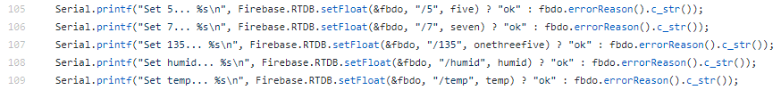
>
> 
>
> *Các Key tự động được tạo ra bao gồm "5", "7", "135", "humid" và
> "temp"*

### d. Theo dõi dữ liệu, gửi thông báo

Với bảng số liệu sau về các mức độ không khí:

CO:

  ------------------------------------------------------------------------
  Tiêu chuẩn             Thời gian       Biểu hiện
  ---------------------- --------------- ---------------------------------
  0-1 ppm                                Mức không khí bình thường.

  9 ppm                                  Chất lượng không khí trong nhà
                                         đạt ngưỡng cho phép tối đa

  35 ppm                 8 hours         Mức độ trung bình cho phép tại
                                         nơi làm việc theo tiêu chuẩn OSHA
                                         Mỹ.

  50 ppm                 8 hours         Mức độ trung bình tối đa tiếp xúc
                                         tại nơi làm việc theo tiêu chuẩn
                                         OSHA Mỹ.

  0.01%(100 ppm)         2\~3hours       Đau đầu nhẹ. Sơ tán người nếu
                                         không gian có nồng độ vượt quá
                                         100 ppm cho mỗi giới hạn tiếp xúc
                                         OSHA.

  0.04%(400 ppm)         1\~2 hours      Nhức đầu xảy ra trong 2,5 giờ đến
                                         3,5 giờ.

  0.08%(800 ppm)         45-min          Chóng mặt, buồn nôn, chuột rút
                                         (co giật)

  0.16%(1600 ppm)        20-min          Nhức đầu, chóng mặt và sẽ chết
                                         trong vòng 2 giờ.

  0.32%(3200 ppm)        5\~10 min       Nhức đầu, chóng mặt, nôn mửa và
                                         sẽ chết trong 30 phút.

  0.64%(6400 ppm)        1\~2 min        Nhức đầu, chóng mặt và sẽ tử vong
                                         trong vòng 10 đến 15 phút.

  1.28%(12800 ppm)       1\~3 min        Gây tử vong.
  ------------------------------------------------------------------------

CO2:

  -----------------------------------------------------------------------
  Mô tả                                Tăng nồng độ      
                                       CO~2~ tương ứng   
                                       với nồng độ       
                                       CO~2~ trong không 
                                       khí xung quanh    
                                       (ppm)             
  ------------------------------------ ----------------- ----------------
                                       Khoảng thông      Giá trị tiêu
                                       thường            chuẩn 

  Chất lượng không khí trong nhà đặc   ≤ 400             350
  biệt                                                   

  Chất lượng không khí trong nhà mức   400 - 600         500
  cao                                                    

  Chất lượng không khí trong nhà mức   600 - 1 000       800
  trung bình                                             

  Chất lượng không khí trong nhà mức   \>1000            1200
  thấp                                                   
  -----------------------------------------------------------------------

Thông báo trên Arduino khá đơn giản, chỉ cần một số câu lệnh điều kiện
để phát ra thông báo bằng loa

Để thông báo qua điện thoại, ta cần sử dụng một Server Python được host
bởi Heroku để giám sát các thay đổi trên server Google Firebase, chúng
ta có thể gửi trực tiếp từ ESP8266 nhưng để thuận tiện cho việc giám
sát, sửa lỗi, Server Python vẫn là tối ưu nhất.

> 

*Tạo tài khoản và server trống trên máy chủ Heroku*

Heroku là một server chứa thuật toán của ứng dụng, chưa có mã lệnh thực
sự, vậy nên tiếp theo, ta sẽ đưa thuật toán vào hoạt động trên server
này 24/7 qua ngôn ngữ lập trình Python.

Server cần một số libraries nhất định để làm việc với Google Firebase

Gửi thông báo sử dụng Firebase Cloud Messaging bằng cách gửi yêu cầu
*request.post* , rất quen thuộc đối với giao tiếp qua mạng. Cung cấp
điều kiện giống như với Airify và các thông tin về Firebase là request
đã có thể được sử dụng.

*Khai báo Khai báo vị trí và mật khẩu của máy chủ truy cập*

*Chúng ta đặt những câu lệnh bên trong một Stream, đây chính là thứ giúp
Python có khả năng giám sát các thay đổi của Firebase*

### e. Đăng kí ứng dụng Airter qua Firebase

Ở Firebase, Google đã hướng dẫn một cách khá rõ ràng về cách thiết lập
ứng dụng có liên kết với Firebase, sau khi hoàn thành các bước, ứng dụng
sẽ sẵn sàng sử dụng cùng với Google Firebase

### f . Xây dựng ứng giao diện ứng dụng

Tất cả các thành phần giao diện đều được xem là Widgets bằng cách đó các
màn hình khác nhau của ứng dụng là những Widgets lồng ghép vào nhau, dễ
dàng theo dõi, kiểm tra và cải thiện.

### g . Tạo hiệu ứng phức tạp

Để đảm bảo hiệu năng ứng dụng, ta phải tạo hiệu ứng một cách độc lập với
ứng dụng, tức là ứng dụng sẽ không đảm nhiệm việc Render mà chỉ đảm
nhiệm việc trình chiếu. Ta sẽ sử dụng Rive để tạo hiệu ứng, Rive có rất
nhiều tùy chọn mà nhà phát triển có thể hoàn toàn tinh chỉnh như edit
video

> Sử dụng Rive đơn giản như các ứng dụng thiết kế đồ họa khác.
>
> 

Tiếp theo sử dụng các công cụ hiệu ứng của Rive để tạo hiệu ứng bằng
cách chuyển đổi các thông số khác nhau của từng bộ phận hình vẽ (Màu
sắc, độ dài, độ mờ,\...) qua những khoảng thời gian nhất định

> 

### h . Xác định vị trí

Xác định vị trí để phục vụ cho OpenWeather API, giúp cho Airter có thể
lấy được dữ liệu từ các trạm đo gần nhất một cách nhanh nhất.

Sử dụng tiện ích GeoLocator:

*Dòng lệnh thể hiện việc lấy dữ liệu vị trí của ứng dụng: ứng dụng sẽ
hỏi hệ điều hành người dùng quyền truy cập vị trí và sẽ hiển thị các lỗi
khác nhau nếu người dùng không đồng ý.*

### i . Nhận dữ liệu từ Internet

Về dữ liệu từ xa, sản phẩm lấy dữ liệu trực tiếp từ các API Bộ Y Tế,
OpenWeather và GitHub. Ta sẽ gặp được một số khó khăn bởi phương thức
trao đổi dữ liệu của ba nguồn ở trên là hoàn toàn khác nhau.

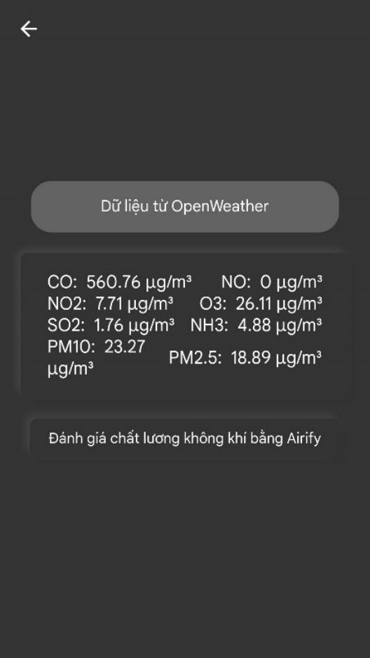Nhận dữ liệu từ OpenWeather:

Dữ liệu được cung cấp bởi OpenWeather bao gồm các loại khí đo được tại
trạm đo gần nhất, vị trí sẽ được cập nhật liên tục trong suốt quá trình
sử dụng.

Dữ liệu lấy về từ response của API khá đơn giản và trực tiếp: Như mọi
API, OpenWeather phản hồi một file JSON với định dạng JSON dễ đọc và dễ
làm việc, một file JSON đơn giản có định dạng như sau:

Ta có thể dễ dàng thấy, vì định dạng JSON khá trực quan, API trả về
thông tin được sắp xếp một cách gọn gàng theo mô hình cây (Tree) với các
Tiêu đề (Header) và giá trị (Value) tương ứng của tiêu đề đó.

Chúng ta có thể lấy dữ liệu từ JSON tương tự một cách đơn giản bằng
Flutter.

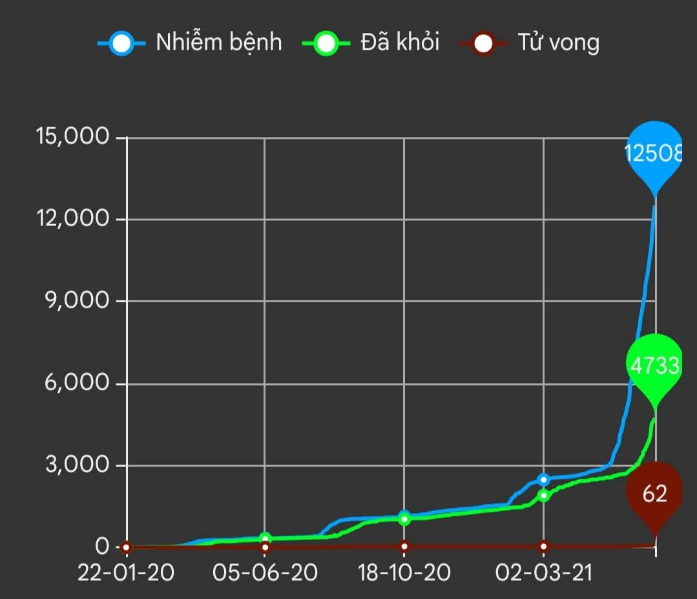Nhận dữ liệu từ Github:

Dữ liệu được cung cấp từ repository của đại học John Hopkins^(3)^, bởi
cơ sở dữ liệu của Bộ Y Tế không cung cấp thông tin cụ thể từng ngày
trong lịch sử, cần thiết cho biểu đồ thống kê.

Github không phải là nền tảng host API truyền thống mà chỉ để lưu trữ
các file trực tuyến, các nhà phát triển đã thống kê

vào file .csv và đặt vào một repository online, ta cần phải lấy dữ liệu
từ file .csv về và mã hóa về dạng JSON của API

Response của file csv sẽ dưới dạng chuỗi (String) và cần phải được
chuyển thành JSON. Ở bảng dữ liệu trên, ta có thể nhận thấy một quy
luật: các cột được chia cách bằng những dấu phẩy, nên thay vì
*\|Vietnam\|2021-01-02\|05:22:33\|* ta sẽ có
*Vietnam,2021-01-02,05:22:33*. Vì vậy chúng ta có thể "tách" một chuỗi
String thành các biến, từ *Vietnam,2021-01-02, 05:22:33* sẽ có 3 biến dữ
liệu: *var Vietnam, var 2021-01-02, var 05:22:33,* sau đó ta sẽ ghép lại
thành một Map JSON và lấy dữ liệu như bình thường:

Nhận dữ liệu từ Firebase:

Cách thức nhận dữ liệu từ Firebase cũng tương tự các APIs, gửi một
response.post và sẽ có giá trị return là một map JSON

Ngoài ra, các *mẹo* và *điều bạn muốn biết* cũng được lưu trữ ở Firebase
để có thể được cập nhật liên tục

### j . Xử lí dữ liệu ở ứng dụng

Các dữ liệu liên quan đến JSON thì khá dễ để sử dụng, chỉ cần đưa nó về
dạng Map\<dynamic, dynamic> thì chỉ cần gọi giá trị như các biến bình
thường. Mặt khác đối với thông tin dịch bệnh COVID-19, cần phải có thêm
một chút xử lí số liệu để có thể vẽ biểu đồ đối với dữ liệu đã nhận
được.

Trong file covid.dart, đầu tiên ta cần khai báo các biến

*Các biến cần quan tâm đến là những List, chúng có khả năng chứa dữ liệu
như những array và sẽ là thứ mà ta làm việc chủ yếu với*

Bây giờ, chúng ta sẽ gọi các *functions* đảm nhiệm vai trò nhận dữ liệu

Tiếp theo, ta sẽ xóa các dữ liệu có index từ 0 đến 3 vì đó đều là những
thông tin về vị trí

Đây chính là giá trị của trục tung, còn giá trị của trục hoành mà chúng
ta muốn chính là ngày tháng, nhưng cơ sở dữ liệu lại không cung cấp thế
nên ta phải tự tạo một *List* chứa ngày. Với mỗi giá trị trong một
*List* đều tương ứng với một ngày trong quá khứ và tất cả các *List* về
*\_deaths, \_confirmed, \_recovered* đều có độ dài bằng nhau (đều có số
phần tử như nhau). Vậy nên ta sẽ tạo một *List* các số tự nhiên có độ
dài tương tự một trong ba *Lists* kia và có khoảng cách với nhau là một
đơn vị.

Và từ đó ta sẽ lấy ngày hiện tại trừ đi số thứ tự các phần tử, ta sẽ có
được các ngày trong quá khứ nhưng bị đảo ngược (vì số thứ tự, số *index*
đi từ nhỏ đến lớn)

Vậy nên ta phải đảo ngược *List* đó

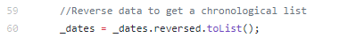

Thế là ta đã có đầy đủ trục tung, trục hoành cho biểu đồ thể hiện tình
hình dịch bệnh COVID-19. Nhưng, thống kê về Vaccine^(4)^ lại được đưa về
theo một Format khác dưới dạng String, ta phải cần thêm một thuật toán
nữa để xử lí số liệu

Dữ liệu nhận về sẽ có dạng như trên, nhưng lại ở loại String, vì vậy ta
lại phải tách chúng ra và xóa bỏ những kí tự đặc biệt như *{\[","\]}* để
số liệu có thể parse sang một loại nhất định như *double, int,
String,\...*

# E. KẾT LUẬN, ĐÁNH GIÁ

## Kết quả thử nghiệm của sản phẩm trong thực tế

### a . Điểm mới, ưu điểm

-   Nhỏ gọn, di động

-   Trực quan, dễ sử dụng

-   Đa chức năng, linh hoạt

-   Sử dụng 3 cảm biến để cho kết quả chính xác và hiệu suất cao hơn

-   Giá thành không cao, có thể phổ biến rộng rãi

-   Có thể sử dụng được trên cả Android, IOS, web, Windows, Mac, Linux
    nhờ Flutter.

### b. Bảng số liệu thu được

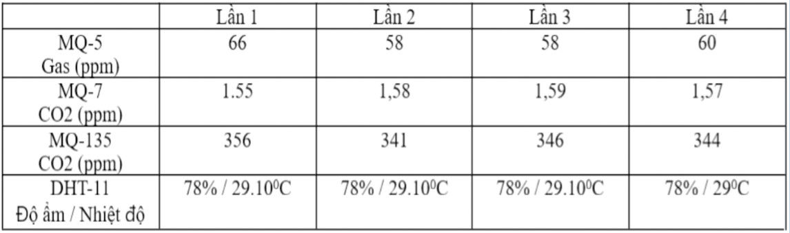

## Hiệu quả đem lại khi sử dụng sản phẩm

Sản phẩm nhỏ gọn, có thể sử dụng ở mọi nơi. Có thể phục vụ cho mục đích
cảnh báo, nghiên cứu, giám sát,\... Ngoài ra sẽ giúp cho mọi người ý
thức được tác động của con người lên môi trường xung quanh, cảnh báo cho
mọi người qua điện thoại thông minh về chất lượng không khí hoặc các vấn
đề khác liên quan đến sự chênh lệch của nồng độ các khí (Ví dụ: Rò rỉ
khí gas, ngộ độc khí than,\...)

## Tiềm năng ứng dụng

Thiết bị và phần mềm sẽ tiếp tục được phát triển để luôn cập nhật các
thuật toán, tính năng mới nhất: Đo lường thêm một số loại khí khác bằng
cách tăng độ nhạy của cảm biến qua biến trở, thêm các phép tính toán và
đánh giá về môi trường,\...

# F. CHÚ THÍCH, TÀI LIỆU THAM KHẢO

(1): <https://en.wikipedia.org/wiki/Log%E2%80%93log_plot>

(2): <https://github.com/tzapu/WiFiManager>

(3): COVID-19 Data Repository by the Center for Systems Science and
Engineering (CSSE) at Johns Hopkins University:

<https://github.com/CSSEGISandData/COVID-19>

(4): Coronavirus (COVID-19) Vaccinations -- Our World in Data

<https://ourworldindata.org/covid-vaccinations?country=OWID_WRL>

Tài liệu về chất lượng không khí:

> 1\. Increased air pollution linked to aggressive behaviour in teens:
>
> <https://envhealthcenters.usc.edu/2017/12/air-pollution-linked-to-bad-teenage-behavior.html>
>
> 2\. CO and its effects to the body:
>
> <https://ephtracking.cdc.gov/showCoRisk.action#:~:text=risk%20than%20others.Symptoms%20and%20Health%20Effects,increased%20risk%20of%20heart%20disease>.

<https://www.cdc.gov/co/faqs.htm#how>

> 3\. Air pollution affects humans' health:
>
> <https://www.researchgate.net/publication/332961763_Final_-_THE_IMPACT_OF_AIR_POLLUTION_ON_HUMAN_HEALTH>
>
> 4\. Health impacts of air pollution:

<https://www.scor.com/sites/default/files/sp42-air_pollution.pdf>

> 5\. Study of the Effects of Air Pollutants on Human Health Based on
> Baidu Indices of Disease Symptoms and Air Quality Monitoring Data in
> Beijing, China:

<https://www.mdpi.com/1660-4601/16/6/1014/pdf>

Các phần mềm đã sử dụng:

1.  Arduino IDE: <https://www.arduino.cc/en/software/>

2.  Android Studio IDE: <https://developer.android.com/studio>

3.  PyCharm IDE: <https://www.jetbrains.com/pycharm/>

4.  Heroku: <https://www.heroku.com/>

5.  Google Firebase: <https://firebase.google.com/>

6.  Rive V2: <https://rive.app/>

7.  Chrome: <https://www.google.com/chrome/>

8.  Github: <https://github.com/>

Các tiện ích Flutter(pubspec.yaml):

1.  rive: 0.7.12

2.  firebase_database: 7.1.0

3.  flutter_neumorphic: 3.0.3

4.  provider: 5.0.0

5.  flutter_spinkit: 5.0.0

6.  firebase_messaging: 10.0.1

7.  vibration: 1.7.3

8.  flutter_animation_progress_bar: 2.0.0

9.  cupertino_icons: 1.0.3

10. firebase_core: 1.2.1

11. modal_bottom_sheet: 2.0.0

12. sleek_circular_slider: 2.0.0

13. sliding_up_panel: 2.0.0+1

14. skeleton_text: 3.0.0

15. http: 0.13.3

16. geolocator: 7.0.3

17. html: 0.15.0

18. geocoder: 0.2.1

19. path_provider: 2.0.2

20. flutter_echarts: 2.1.0

21. intl: 0.17.0

22. animate_icons: 2.0.0

23. url_launcher: 6.0.6
